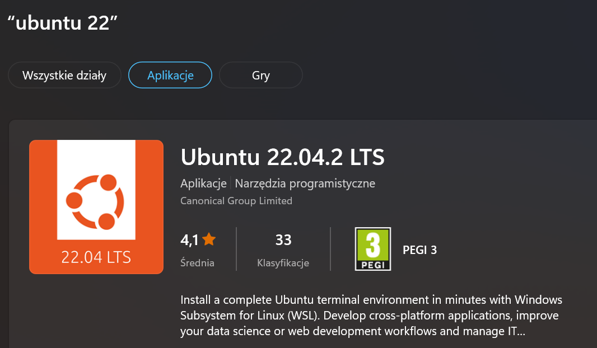

# WSL Setup guide for Windows users
## Requirements
- Internet connection
- Windows 10 or 11
- Your processor must support virtualization
- Windows Core Izolation must be turned on
## Enabling wsl feature
```powershell
dism.exe /online /enable-feature /featurename:VirtualMachinePlatform /all /norestart
dism.exe /online /enable-feature /featurename:Microsoft-Windows-Subsystem-Linux /all /norestart
```
or you can simply run the following command in powershell that will do the same thing plus install default Ubuntu distro
```powershell
wsl --install
```
Unfortunately, this will install Ubuntu 20.04 if you want to install Ubuntu 22.04 you will have to do it manually by following the steps below

## Installing Ubuntu
### Checking if Ubuntu-22.04 is available
```powershell
wsl -l -o
```
If you don't see [Ubuntu 22.04](https://www.microsoft.com/store/productId/9PN20MSR04DW) in the list, you will have install to it from the Microsoft Store
 

### Installing Ubuntu-22.04
```powershell
wsl --install -d Ubuntu-22.04
```
### Updating \& Upgrading Ubuntu
```bash
sudo apt update && sudo apt upgrade
```
## Installing packages
### Installing git \& python
```bash
sudo apt install git python3.10 python-is-python3 python3-pip cmake build-essential pkg-config -y 
```
### Installing conan
```bash
pip3 install conan
```
### Configuring conan profile
```bash
conan profile detect --force
```

# Additional tips
## Making your terminal look better
### Installing zsh
```bash
sudo apt install zsh -y
```
### Installing oh-my-zsh
```bash
sh -c "$(curl -fsSL https://raw.github.com/ohmyzsh/ohmyzsh/master/tools/install.sh)"
```
### Installing powerlevel10k
```bash
git clone --depth=1 https://github.com/romkatv/powerlevel10k.git ${ZSH_CUSTOM:-$HOME/.oh-my-zsh/custom}/themes/powerlevel10k
```
Set ```ZSH_THEME="powerlevel10k/powerlevel10k"``` in ```~/.zshrc```.
### Installing zshautosuggestions
```bash
git clone https://github.com/zsh-users/zsh-autosuggestions ${ZSH_CUSTOM:-~/.oh-my-zsh/custom}/plugins/zsh-autosuggestions
```
Add ```zsh-autosuggestions``` to the plugins array in ```~/.zshrc```.

### Installing zsh-syntax-highlighting
```bash
git clone https://github.com/zsh-users/zsh-syntax-highlighting.git .zsh-syntax-highlighting
echo "source ${(q-)PWD}/.zsh-syntax-highlighting/zsh-syntax-highlighting.zsh" >> ${ZDOTDIR:-$HOME}/.zshrc
```
You can also do this with oh-my-zsh plugin manager
```bash
git clone https://github.com/zsh-users/zsh-syntax-highlighting.git ${ZSH_CUSTOM:-~/.oh-my-zsh/custom}/plugins/zsh-syntax-highlighting
```
Add ```zsh-syntax-highlighting``` to the plugins array in ```~/.zshrc```. IT MUST BE THE LAST PLUGIN IN THE ARRAY.

### More plugins that may be useful
- git, git-auto-fetch
- sudo
- python 
